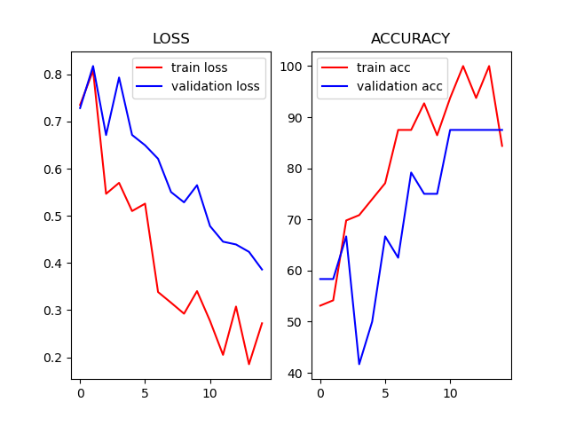
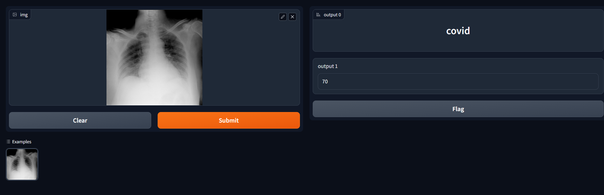

# Covid19 Detector
<h3>A PyTorch covid19 classifier model that based on resnet18 and implement with an user interface in gradio.</h3>

*data_setup.py*: a file to prepare data into dataloader  
*engine.py*: a file to put train and validation or test loops 
*model_builder.py*: a file to rebuild the resnet18 
*train.py*: a file to train our model, this is the training file 
*utils.py*: a file to put metrics file such ass acc_fn, save model and plotting results 
*prediction.py*: a file to use our model and prepare that for using in the gradio ui 
*ui_gradio.py*: gradio ui 
*covid19-dataset*: a dir that contains our dataset in train and test subdir 
*saved_model*: a dir that contains our finetuning model's checkpoints 
*resnet18.pth*: a file contains the resnet18 checkpoints 

### results of the fine-tuning model that exist in saved_model dir show in this picture: 

### UserInterface: 

